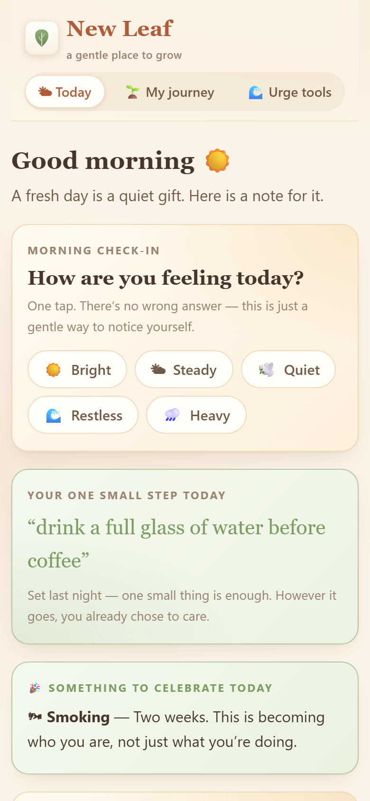
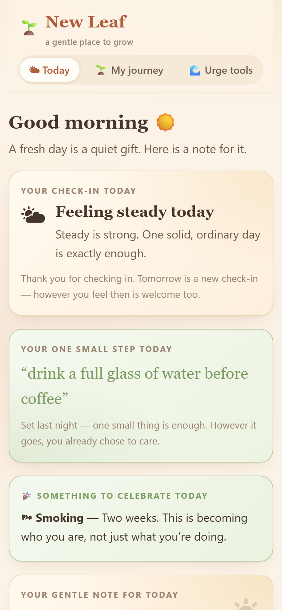
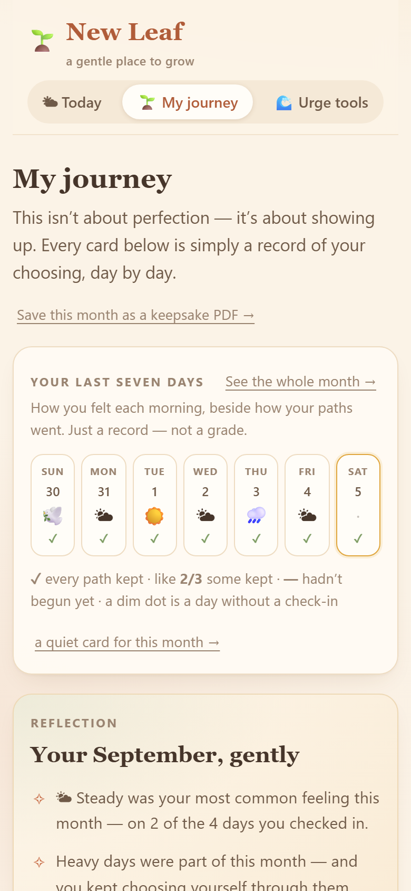
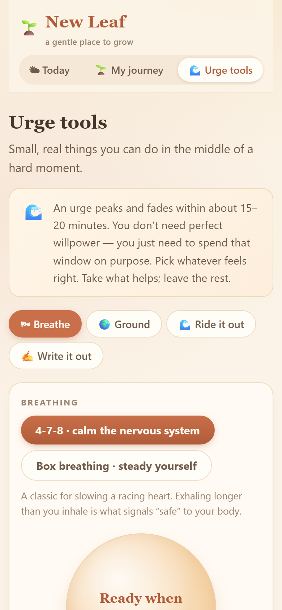

# 🌱 New Leaf — a gentle place to grow

[](https://github.com/harmless-beep/newleaf/actions/workflows/pages.yml) · [▶ Live site](https://harmless-beep.github.io/newleaf/)

A warm, private, ad-free web app for people softening old habits —
 alcohol, smoking, lust, laziness, procrastination, and fear
of the unknown — **one day at a time**.

No accounts. No tracking. No ads. Everything (your habits, streaks, and
journal) is stored only in your own browser, on your own device.

## A look inside

The screenshots below are the web app — the Android app wraps the exact
same interface.

| | |
| --- | --- |
| <p align="center"><br><em>Today — the morning ask</em></p> | <p align="center"><br><em>After a gentle check-in</em></p> |
| <p align="center"><br><em>My journey — habits, streaks, the week</em></p> | <p align="center"><br><em>Urge tools — what to do in a hard moment</em></p> |

Regenerate them anytime with
`npm run build && npm run preview` then
`node scripts/make-shots.mjs http://127.0.0.1:4173`.

## What's inside

| Tab | What it does |
| --- | --- |
| **🌤 Today** | Daily check-ins: a gentle morning ask ("how are you feeling?") plus an optional evening one ("how did today actually go?") that appears once the day is closing — especially if the morning went unanswered. Answering it ends with a quiet wind-down line and the option to set tomorrow's one small step, which greets you the next morning. Time-aware greeting, a gentle "note for today", milestone celebrations, an at-a-glance view of your streaks, and quick links into the urge tools. |
| **🌱 My journey** | Choose the habits you want to soften. Each gets a card with days-going-strong, your best run, progress to the next milestone, an affirmation, and small steps that help. "I slipped today" resets gently — your best is always kept. A strip of your last seven days shows each day's mood beside how your paths went (expandable to a full-month calendar you can browse back through history), and each month gets its own gentle reflection — the current one as it unfolds, past ones in honest hindsight. Every closed month is preserved automatically as a keepsake the moment it ends (a "Keepsakes" shelf pages back through them, and a later slip never rewrites what a closed month truly was). Any month can be saved as a keepsake PDF straight from your device, and any habit's run or any month can be drawn into a quiet celebration card (PNG) to download or share — made on-device, nothing uploaded. |
| **🌊 Urge tools** | Four small, real things to do in a hard moment: breathing (4-7-8 or box), the 5-4-3-2-1 grounding walk, "ride the wave" (a timed urge-surfing timer), and a private journal with a searchable, month-grouped archive that looks back on old entries kindly. |

## Design notes

- The tone throughout is **acceptance first**: no shame, no guilt trips,
  no toxic positivity. A slip is treated as information, not failure.
- First-time visitors get one warm welcome screen — logo, a plain-spoken
  hello, a one-line introduction to each tab, and a tiny breathing circle
  they can tap to try an urge tool before anything is asked of them.
  Returning visitors never see it again.
- Milestone days are honoured with a gentle, one-time leaf burst (small
  sage leaves drifting up around a quiet “Day N” card) — celebrated once,
  never nagging, and skipped entirely for reduced-motion users.
- The icons show the *goal* (lotus, water, lungs, sun…) rather than the
  habit itself.
- Milestones are celebrated at 1, 2, 3, 5, 7, 10, 14, 21, 30, 45, 60, 90,
  120, 180, 270 and 365 days.
- Respects `prefers-reduced-motion`.
- A footer gently notes that the app is a companion, not medical advice,
  and encourages reaching out to a real person when needed.

## Run it

```bash
npm install
npm run dev      # local development
npm run build    # production build (output in dist/)
npm run preview  # preview the production build
```

## Android app

New Leaf also ships as a native Android app — a small WebView wrapper
that loads the same site from the app's own files, so it works fully
offline with no INTERNET permission. Data stays on your device, same
as the web version.

- **Install the APK**: grab `NewLeaf-1.1.0.apk` from the repo root,
  copy it to your phone, and open it (allow "install unknown apps"
  when prompted). Requires Android 8.0+.
- **Latest CI build**: every push to `main` rebuilds the app and
  attaches a fresh APK to the rolling GitHub release **"New Leaf
  Android — latest"** (see the Releases page) — useful when you're
  away from this machine. Those APKs are debug-signed, so installing
  over an older, differently-signed APK requires uninstalling first
  (which clears the app's on-device data).
- **Build it yourself**: `cd android && ./gradlew assembleRelease`
  (needs the Android SDK and Java 17). The signed APK lands in
  `android/app/build/outputs/apk/release/`.
- The release keystore (`android/newleaf-release.keystore`) is **not**
  committed — it lives only on this machine so you can sign future
  updates. Keep it safe; the password is in `android/keystore.properties`.
- The wrapper's warm details: edge-to-edge display (the cream page runs
  behind transparent system bars and pads itself around them), a cream
  splash whose leaf mark glides up into the header logo the moment the
  page paints its first frame — as the cream dissolves around it (never
  lifting onto a blank screen; a tap anywhere skips the wait instantly), a
  soft native tick on every check-in tap, sage status bar accents, and a
  hand-drawn leaf launcher icon (real PNGs at every mipmap density — cream
  tile, transparent adaptive foreground, plus a round variant) all match
  the site's palette. Regenerate the icon anytime with
  `node scripts/make-icon.mjs`.
- **Gentle evening reminder (optional, in-app only):** if the evening
  check-in is left open, a quiet "Evening check-in" card on the Today
  screen lets you ask for one soft nudge each day at a time you pick.
  It's scheduled natively with `AlarmManager`, survives reboots, and
  never nags: the alarm only posts a notification when that day's
  evening check-in is still unanswered, then quietly re-arms for
  tomorrow. Fully local — no network, and nothing leaves the device.
  It fires on time when the system grants exact alarms; otherwise it
  falls back to a near-time window (Android 13+ may need "Alarms &
  reminders" special access enabled for the exact kind).

## Add your own content

## Add your own content

- Habits & their copy: `src/data/habits.js`
- Message-of-the-day, milestones, check-in moods, tool lines: `src/data/wisdom.js`
- Palette and styles: `src/styles.css`

## Commits

Every commit in this project is authored by the repo owner alone. A
`commit-msg` hook (`git-hooks/commit-msg`) strips any co-author footer
before a commit is created, so it can never land in the history. After
cloning the repo, run `sh scripts/install-git-hooks.sh` once to install
it into your checkout.

## Privacy

No code in this project ever sends your data anywhere. Data lives in
`localStorage` under the keys `nl.picks`, `nl.runs`, `nl.journal`, `nl.checkins`, `nl.steps`
and `nl.keepsakes` (a frozen copy of each closed month),
and can be wiped with the "Reset my data" link in the footer.
